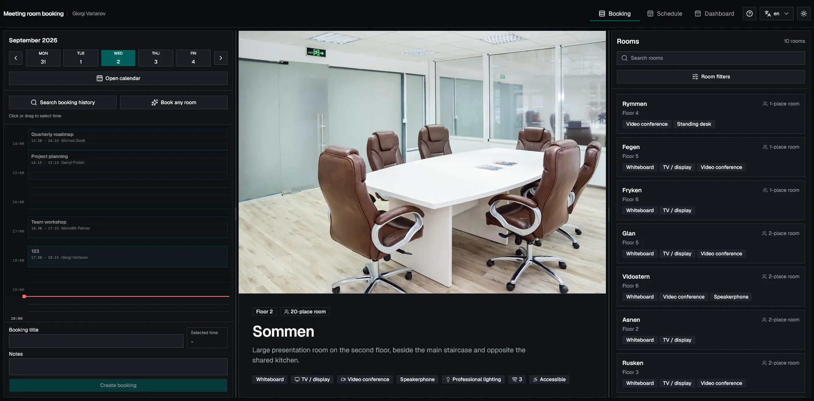
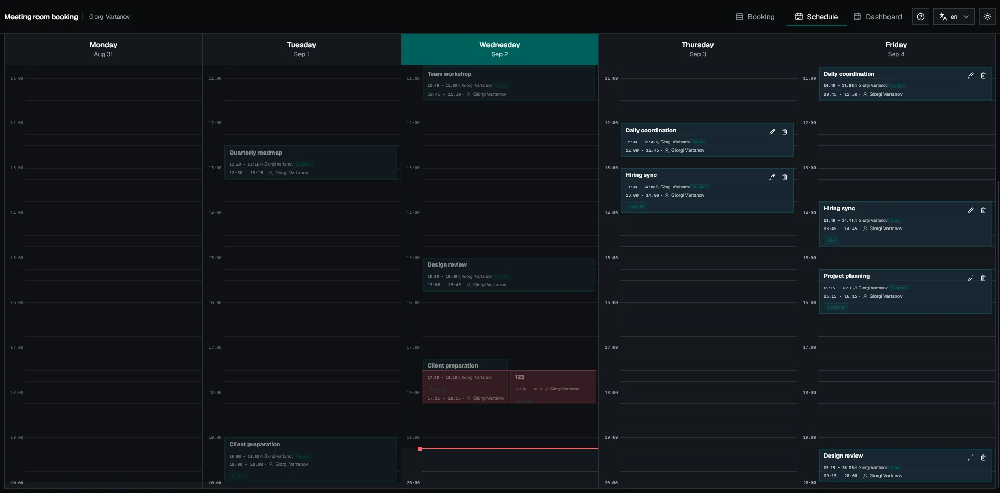
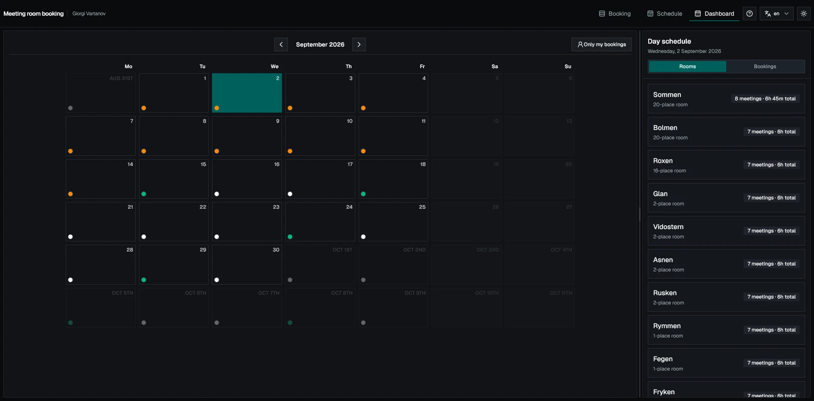
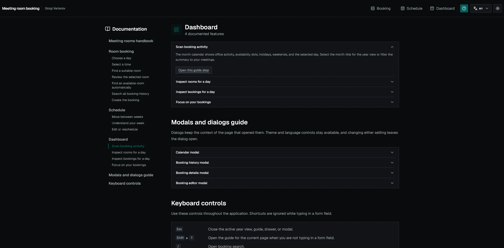
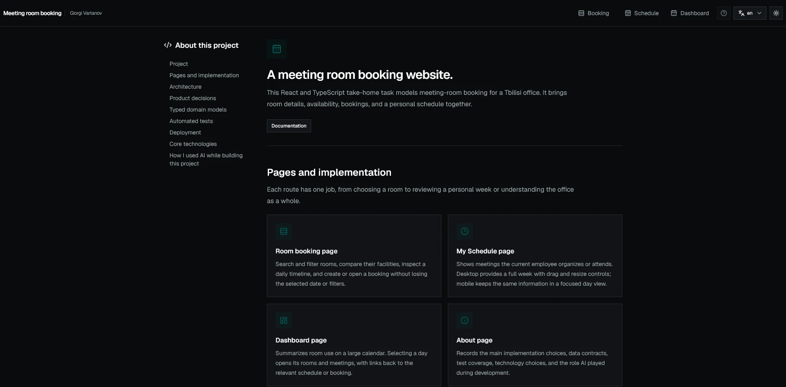

# Internal Meeting Room Booking System

**TL;DR:** A React and TypeScript meeting-room booking take-home task with booking flows, schedules, localization, and guided help.

[View the live demo](https://internal-meeting-room-booking-system.netlify.app)

This frontend take-home task models a meeting room booking app for a hypothetical company office. It runs without a backend: Axios makes the requests, TanStack Query manages response data and caches it, and MSW is used to simulate the backend.

The task requirements asked for a dashboard, searchable rooms, daily and weekly schedules, booking management, URL-backed state, local JSON seed data, and persistence across refreshes. I wrote the decisions I made below.

## Table of contents

- [Assignment coverage](#assignment-coverage)
- [Additional implementation work](#additional-implementation-work)
- [Technology and architecture](#technology-and-architecture)
- [Product decisions and assumptions](#product-decisions-and-assumptions)
- [Seed data and browser persistence](#seed-data-and-browser-persistence)
- [Booking policy](#booking-policy)
- [AI use in this project](#ai-use-and-review)
- [How to run locally](#run-locally)
- [How was it deployed to Netlify](#deploy-to-netlify)
- [Validation](#validation)
- [Screenshots](#screenshots)

## Assignment coverage

- **Dashboard:** The large calendar summarizes office activity. Selecting a date shows the rooms booked that day and the meetings in them; selecting a room or meeting opens its details and links to the relevant schedule. Unbooked rooms are intentionally omitted from this activity view. The calendar supports both month and year selection.
- **Rooms:** Employees can search and filter by capacity, equipment, air conditioning, accessibility, and lighting, then compare room details before making a choice.
- **Room booking:** The daily timeline shows availability and existing meetings. A user can click or drag across 15-minute slots, create a booking, inspect its details, and edit or cancel it. The 15-minute interval controls slot selection and minimum duration; a booking may start no earlier than one hour before the current time and may be scheduled up to the configurable booking horizon (right now its 2 month).
- **My Schedule:** The weekly view combines meetings that the current employee organizes and attends. Desktop supports dragging and resizing upcoming meetings owned by that employee; mobile presents one selected workday at a time.
- **Search:** The full booking history can be filtered by text, date, room, organizer, capacity, amenities, and ownership, including past and cancelled records.
- **Responsive use:** Resizable desktop panels become drawers or focused views on smaller screens without removing the core booking actions.
- **URL state:** Selected rooms, dates, filters, open bookings, guide steps, and other useful navigation state survive refreshes and can be shared as links.

## Additional implementation work

Beyond the task, I added English and Georgian localization, light and dark themes, drag selection and rescheduling, booking resizing, keyboard shortcuts, and detailed loading, error, and confirmation states.

Guides are implemented once and used across the app: booking, schedule, dashboard, and key dialogs all use the same definitions. They support an optional first-visit prompt, URL-addressable steps, target-aware tooltips, and links back to the relevant handbook section.

Some of these additions are intentionally out of scope for the original task. I included them because my current portfolio projects were starting to feel a bit outdated, and I plan to include this project in my portfolio as a more current example of product, interaction, and accessibility patterns.

## Technology and architecture

- React 19, TypeScript, and Vite.
- Tailwind CSS v4, shadcn/ui, Base UI, and Lucide React.
- React Router for routes and shareable URL state.
- Axios resource functions and TanStack Query hooks for all application requests and server state.
- React Hook Form and Zod for booking forms and validation.
- date-fns and a fixed `UTC+4` application timezone.
- MSW for a REST-shaped mock API (that is used in a place of a backend, with JSON files).
- Local JSON files for the initial rooms, employees, bookings, and Georgian holidays.
- Schema-prefixed `localStorage` collections for persistent mock data, plus independent keys for preferences and guide progress.

There is no authentication or deployed backend because the assignment focused mainly on frontend implementation. Giorgi Vartanov (me) is the simulated current user. The application boundary is still shaped like a production system: components use query and mutation hooks, hooks call typed resource functions, and every request goes through the shared Axios client. MSW intercepts those REST-shaped requests, applies the booking rules, and writes accepted changes through repository helpers.

The UI never imports seed JSON, MSW handlers, or storage helpers. A real REST API can replace MSW by changing the API configuration.

Feature modules keep React components in `components/`, non-React helpers in `utils/`, and contexts or static data in dedicated directories. Feature-level `index.ts` files expose their public API, while larger schedule areas are grouped into booking, editor, navigation, and timeline modules.

The 200-line source-file target is a guideline for ordinary modules. The remaining longer files are route orchestrators, pointer-driven timeline or guide state machines, atomic booking transactions, or upstream-style shadcn primitives where splitting tightly coupled state would make the interaction harder to follow.

Booking traffic is split into paginated endpoints for search, room schedules, employee schedules, and booking details. List hooks fetch the requested page and prefetch likely next data. The weekly view prefetches adjacent weeks, while booking details and room images are warmed on hover and cached by TanStack Query.

## Product decisions and assumptions

The requirements deliberately left some implementation details open. These are the decisions that most affect behavior:

- **Room availability is the main conflict check.** Two confirmed bookings cannot occupy the same room at the same time. An organizer may reserve different rooms for parallel sessions or breakout space. Attendee conflicts are shown but do not block saving.
- **Availability covers the whole meeting.** A time range is offered only when at least one suitable room remains free from start to end. Checking each 15-minute segment against a different room would produce false availability.
- **Booking rules have one source.** Working hours, 15-minute slots, the six-hour maximum, the two-month horizon, the one-hour past allowance, weekends, and holidays are centralized and checked by both the UI and MSW.
- **Weekends and holidays are separate policies.** Both are non-bookable by default but can be changed independently.
- **Georgian holidays include fixed and movable dates.** Fixed holidays recur from month-and-day rules. Good Friday, Holy Saturday, Easter Sunday, and Easter Monday are recalculated from Orthodox Easter for each year. The mock API expands both rule types into ordinary dated records before the UI receives them.
- **Office time takes precedence over device time.** API timestamps are ISO 8601 instants, while display and calendar grouping use the fixed Tbilisi timezone (`UTC+4`). A viewer's local timezone cannot move a meeting to another office day.
- **Cancellation keeps history.** Cancelling a booking changes its status and records a timestamp instead of deleting it, so past searches and audit information remain useful.
- **Useful navigation state belongs in the URL.** A refresh, browser back action, or copied link should reopen the same room, date, filters, booking, dialog, or guide context when applicable.
- **English and Georgian are both supported.** Seeded names, departments, rooms, and holidays are localized. User-entered booking titles and notes remain in whichever language the user writes them.

## Seed data and browser persistence

The bundled JSON dataset starts with exactly 754 bookings so pagination, dense calendars, room conflicts, and search behavior can be exercised realistically. Room names come from Nordic lakes. Employee, department, room, and holiday records include English and Georgian text. Seeded booking copy is English, while new or edited titles and notes preserve the language entered by the user.

On the first visit, repository helpers copy the seed collections from JSON into `localStorage`. Creates, edits, and cancellations update the browser-stored collections; they do not modify the bundled JSON files. Those changes therefore persist across refreshes on the same browser and origin.

The phrase **schema-prefixed storage** refers to keys such as `meeting-room-booking:v15:bookings`. `DATA_SCHEMA_VERSION` lets a development build move to a new dataset shape or reseed selected collections without mixing incompatible records. This is unrelated to guide content versions. Guide progress currently uses its own `meeting-room-booking:guide-progress:v1` key, while language and panel-size preferences also use separate keys.

## Booking policy

- Office timezone: fixed `UTC+4`; dates and times are shown in Tbilisi time regardless of the viewer's device timezone.
- Working hours: 07:00–20:00, configurable through the constants.
- Booking interval and minimum duration: 15 minutes, configurable through the constants. This interval does not change the past-time allowance: a booking may start no earlier than one hour before the current time.
- Maximum duration: 6 hours.
- Earliest permitted start: one hour before the current time.
- Future booking horizon: 2 months.
- Weekends and Georgian public holidays are non-bookable by default and controlled independently.
- A room cannot contain overlapping confirmed bookings.
- Only the organizer can edit or cancel a booking.
- Cancelling an active or upcoming booking changes its status to `cancelled`; the record remains available for audit and history. ended booking cannot be cancelled.
- The organizer is inferred from the simulated current employee; there is no authentication flow in this app, because its frontend focused.

## AI use and review

I built the application over three focused, not full development days and used Codex throughout implementation, refactoring, testing, codebase review, and documentation. I used GPT-5.6 Sol for architecture and overall reviews; GPT-5.6 Terra for most most implementations and cleanup; and GPT-5.6 Luna for quick questions about codebase and small verification tasks.

The product decisions, visual direction, architecture, and acceptance of the finished work remained my responsibility. I designed the flow from pages through TanStack Query hooks and typed Axios resources to MSW handlers, domain validation, and repositories. I also decided which state belonged in the URL, how mutations should update or invalidate schedules and dashboards, and where booking policy should live.

My review loop was to compare generated work with the task requirements, exercise it in the browser, and inspect the implementation before accepting it. Codex ran formatting, tests, linting, and production builds as part of that loop. I directly handled restyling, performance fixes, responsive behavior, and features that were quicker or clearer to implement myself than to specify to AI, as well as work that needed correction after an AI attempt.

Examples that required substantial human review or correction include:

- **Calendar performance:** A Codex-generated implementation recreated timezone formatters and rescanned all bookings inside nested day and slot loops, making the full calendar noticeably slow with the complete seed dataset. I profiled it in the browser, reused the formatters, generated Tbilisi calendar keys consistently, and moved booking aggregation outside the nested render loops.
- **Calendar modal header controls:** When placing the calendar controls in the modal header, the AI-generated version did not achieve the intended layout and behavior reliably, so I implemented that part directly.
- **Drag-and-drop and resizing:** Basic pointer movement did not cover resizing from both edges, preserving duration, snapping to 15-minute intervals, or previewing room conflicts before a drop.
- **Responsive scheduling:** Shrinking the desktop week produced cramped columns and horizontal scrolling, so I replaced it with a focused single-day mobile view and moved appropriate controls into drawers.
- **URL and dialog state:** Generated implementations often defaulted to local component state; I identified which rooms, dates, filters, bookings, dialogs, and guide steps needed to survive refreshes and browser navigation.
- **Rules across UI and API boundaries:** Some changes enforced a rule only in the form or only in MSW. I centralized the policy values and checked create, edit, drag, resize, and cancellation behavior at both boundaries. I also added a separate Orthodox Easter calculation so movable Georgian holidays are blocked alongside fixed-date holidays.
- **Visual and interaction polish:** Functionally complete generated layouts still needed improvements to spacing, hierarchy, loading geometry, accessibility feedback, and mobile behavior.

## Run locally

```sh
npm install
npm run dev
```

MSW starts automatically before React in Vite's development mode. local `VITE_ENABLE_MSW` isn't needed, variable: `src/mocks/enableMocking.ts` enables the worker whenever `import.meta.env.DEV` is true.

On first use, seed JSON is copied into browser storage. Later booking changes are persisted through the repository layer and remain after refresh.

## Deploy to Netlify

The included `netlify.toml` runs the production build, publishes `dist`, and rewrites application routes to `index.html` so direct visits to nested React Router URLs work. Its `[build.environment]` section also creates the `VITE_ENABLE_MSW=true` build environment variable automatically on Netlify for the deployed demo.

The variable is needed for this static production demo because Vite's `DEV` flag is false in a production build. Without either MSW or a real backend, the deployed interface would send requests to `/api` with nothing available to answer them. You do not need to create the variable in Netlify's dashboard when Netlify uses the committed `netlify.toml`; Netlify reads the file and supplies the variable to the build automatically. On another static host, set `VITE_ENABLE_MSW=true` during the build if the deployed demo should continue using MSW.

To deploy through the Netlify dashboard:

1. Import the repository as a new site.
2. Keep the build settings detected from `netlify.toml`.
3. Deploy the site.

If a real API replaces MSW, remove the `VITE_ENABLE_MSW` setting from `netlify.toml` (and any host dashboard override) and configure the Axios base URL for that service.

## Validation

The project has 17 automated tests across seven files. Vitest covers booking validation and schemas, domain rules, MSW behavior, persistence, overlaps, permissions, and Georgian holiday generation. React Testing Library tests exercise visible creation and editing forms, user input, validation, enabled state, and submitted drafts. A dedicated `tsconfig.test.json` keeps tests and JSON fixtures under the same strict path aliases and type checks as application code.

```sh
npm run format:check
npm run lint
npm test
npm run build
```

## Screenshots

The screenshot files live under `docs/screenshots/`, outside the application bundle, because they are used only by this GitHub README.

### Room booking



### My Schedule



### Dashboard



### Documentation



### About


